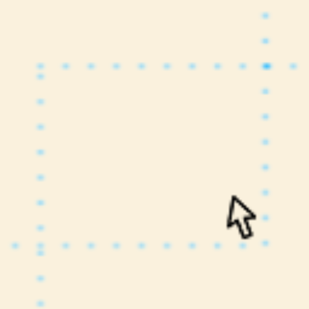

<p align="center">
<a href="https://github.com/Swarag-N/Dev-Helper">

</a>
<h1 align="center"> Dev Helper </h1>
<h4 align="center"> Dev-Helper is a Chrome Extension to view borders of DOM Elements (on mouse hover). <h4>
</p>

# Preview 

<p align="center">
<a href="https://github.com/Swarag-N/Dev-Helper"></a>
<br>
<a href="https://youtu.be/-X_E_3CDWOw"></a>
</p>


## Features

- See Borders of DOM Elements useful for Debugging CSS
- Customizing Options
  - Border Length `1 - infinity`
  - Border Color
    - Select Through Color Box
    - Give HEX,RGB
  - Border Type
    - Dotted
    - Solid
    - Dashed
    - Few More
- Reset to Default

## Install

- Google Chrome WebStore

  - Coming Soon

- Add Manually
  - Download Latest Version of `src.zip`
    - <https://github.com/Swarag-N/Dev-Helper/releases>
  - Navigate to `chrome://extensions/`
  - Toggle `Developer Mode` at Top Right Corner
  - Use `Load unpacked` load the Extracted files from `src.zip` to Browser
  - Refresh the Tab to start Using Extension

## Contribute

### Local Development

- Clone the source

  ```sh
  git clone -b develop https://github.com/Swarag-N/Dev-Helper.git
  ```

- Load up Chrome browser, go to URL `chrome://extensions`, and enable _Developer Mode_
- Click on `Load Unpacked`, and use the `src` directory as the root.

<p align="center">
Made with :heart: by <a href="https://github.com/Swarag-N">Swarag Naryanasetty</a>
</p>
